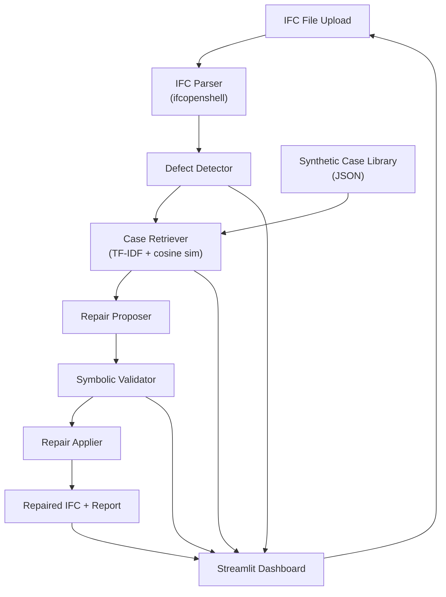

# BIMRepair — Automated BIM Lint & Repair Assistant

## Goal

Build an end-to-end MVP that parses IFC files, detects common BIM defects, retrieves similar past cases from a synthetic library, proposes repairs, validates them with symbolic rules, and auto-applies safe fixes — all visible through a Streamlit dashboard.

---

## Architecture Overview



### Why This Architecture?

| Decision | Rationale |
|----------|-----------|
| **ifcopenshell** for parsing | Industry-standard, open-source, handles IFC2x3/IFC4, has `ifcopenshell.api` for safe editing |
| **TF-IDF + cosine similarity** for retrieval | Zero external dependencies beyond scikit-learn, no GPU needed, fast, deterministic, perfect for hackathon |
| **Rule-based defect detection** | Reliable, explainable, no training needed — detects structural issues via IFC graph traversal |
| **Case-based repair proposal** | Retrieves similar defect→repair pairs and adapts them; no LLM API required |
| **Symbolic validation** | Deterministic post-check ensures IFC schema validity before any write |
| **Streamlit dashboard** | One-command demo, rich widgets, zero frontend code |

> [!NOTE]
> We deliberately avoid LLM APIs to stay fully offline and free. The "model" is the TF-IDF retrieval + rule-based repair adapter. This is honest, reproducible, and hackathon-appropriate. If a local LLM (e.g., Ollama) is available, it can optionally be plugged in for natural-language repair explanations.

---

## Proposed File Structure

```
c:\Users\BhaNu\Desktop\BIM Hack\
├── requirements.txt
├── README.md
├── run.bat                          # One-click launcher
├── config.py                        # Central configuration
│
├── data/
│   ├── case_library.json            # Synthetic defect→repair case library
│   └── sample_model.ifc            # Generated sample IFC with seeded defects
│
├── src/
│   ├── __init__.py
│   ├── ifc_parser.py               # IFC loading, entity extraction, relationship mapping
│   ├── defect_detector.py          # Rule-based defect detection engine
│   ├── case_library.py             # Case library loader + TF-IDF retrieval
│   ├── repair_proposer.py          # Repair proposal logic (case adaptation)
│   ├── validator.py                # Symbolic IFC validation rules
│   ├── repair_applier.py           # Safe repair application to IFC model
│   └── pipeline.py                 # End-to-end orchestrator
│
├── generators/
│   ├── generate_cases.py           # Synthetic case library generator
│   └── generate_sample_ifc.py      # Sample IFC model generator with seeded defects
│
└── app.py                           # Streamlit dashboard
```

---

## Proposed Changes

### Component 1: Configuration & Dependencies

#### [NEW] [requirements.txt](file:///c:/Users/BhaNu/Desktop/BIM%20Hack/requirements.txt)
- `ifcopenshell` — IFC parsing and editing
- `scikit-learn` — TF-IDF vectorizer + cosine similarity
- `streamlit` — Dashboard UI
- `pandas` — Data manipulation for display
- `plotly` — Charts in dashboard

#### [NEW] [config.py](file:///c:/Users/BhaNu/Desktop/BIM%20Hack/config.py)
- Paths to case library, sample IFC, output directory
- Confidence thresholds for auto-apply vs. flag-only
- Defect severity levels

---

### Component 2: Synthetic Dataset / Case Library Generator

#### [NEW] [generators/generate_cases.py](file:///c:/Users/BhaNu/Desktop/BIM%20Hack/generators/generate_cases.py)

Generates `data/case_library.json` containing ~30-50 defect→repair case entries. Each case:

```json
{
  "case_id": "CASE_001",
  "defect_type": "missing_property",
  "entity_type": "IfcWall",
  "severity": "high",
  "safe_to_auto_apply": true,
  "defect_description": "IfcWall is missing the 'LoadBearing' property in Pset_WallCommon",
  "ifc_snippet_before": "... IFC STEP snippet ...",
  "ifc_snippet_after": "... repaired IFC STEP snippet ...",
  "json_context_before": { ... },
  "json_context_after": { ... },
  "repair_action": "Add property 'LoadBearing' with value .FALSE. to Pset_WallCommon",
  "explanation": "Walls must declare load-bearing status per IFC schema. Default .FALSE. is safe when structural analysis is absent."
}
```

**Defect categories covered:**
1. Missing properties (LoadBearing, FireRating, IsExternal, etc.)
2. Broken spatial containment (element not in any IfcBuildingStorey)
3. Disconnected storey (IfcBuildingStorey not linked to IfcBuilding)
4. Invalid parent-child (IfcSpace not in correct storey)
5. Naming inconsistency (empty Name, duplicate Names)
6. Missing material association

#### [NEW] [generators/generate_sample_ifc.py](file:///c:/Users/BhaNu/Desktop/BIM%20Hack/generators/generate_sample_ifc.py)

Creates a minimal valid IFC4 file with walls, slabs, doors, spaces, and storeys — then **intentionally introduces defects** (removes properties, breaks relationships, duplicates names) so the pipeline has something to detect and repair.

---

### Component 3: IFC Parser

#### [NEW] [src/ifc_parser.py](file:///c:/Users/BhaNu/Desktop/BIM%20Hack/src/ifc_parser.py)

- `load_model(path)` → returns ifcopenshell model
- `extract_entities(model)` → list of dicts with entity info (type, GUID, name, properties, relationships)
- `extract_spatial_hierarchy(model)` → tree of Site→Building→Storey→Space→Elements
- `extract_property_sets(entity)` → dict of property sets and their values
- `get_relationships(model, entity)` → containment, aggregation, association links

---

### Component 4: Defect Detector

#### [NEW] [src/defect_detector.py](file:///c:/Users/BhaNu/Desktop/BIM%20Hack/src/defect_detector.py)

Rule-based engine with these checks:

| Check ID | Defect Type | Logic |
|----------|-------------|-------|
| D001 | Missing required property | Entity type has expected Pset (e.g., Pset_WallCommon) but property is absent |
| D002 | Broken spatial containment | Element has no `IfcRelContainedInSpatialStructure` |
| D003 | Disconnected storey | `IfcBuildingStorey` not aggregated into any `IfcBuilding` |
| D004 | Invalid parent-child | `IfcSpace` not contained in any storey |
| D005 | Naming inconsistency | `Name` attribute is None, empty, or "Unnamed" |
| D006 | Missing material | Element has no `IfcRelAssociatesMaterial` |

Each detected defect returns a structured `Defect` object with:
- `defect_id`, `defect_type`, `entity_guid`, `entity_type`, `severity`, `description`, `context_json`

---

### Component 5: Case Retrieval

#### [NEW] [src/case_library.py](file:///c:/Users/BhaNu/Desktop/BIM%20Hack/src/case_library.py)

1. Loads `case_library.json`
2. Builds TF-IDF index over `defect_description` + `entity_type` + `defect_type` fields
3. For a given detected defect, constructs a query string from its description
4. Returns top-K similar cases with similarity scores
5. Filters by `defect_type` match for higher precision

---

### Component 6: Repair Proposer

#### [NEW] [src/repair_proposer.py](file:///c:/Users/BhaNu/Desktop/BIM%20Hack/src/repair_proposer.py)

Takes a defect + retrieved cases and produces a `RepairProposal`:
- Adapts the best-matching case's repair action to the current entity
- Substitutes entity-specific values (GUID, name, property values)
- Assigns confidence score based on:
  - similarity to retrieved case
  - whether defect type matches exactly
  - whether the repair is flagged `safe_to_auto_apply`

---

### Component 7: Symbolic Validator

#### [NEW] [src/validator.py](file:///c:/Users/BhaNu/Desktop/BIM%20Hack/src/validator.py)

Pre-apply validation checks:
- Property value type matches expected IFC type
- Relationship target entity actually exists in the model
- No circular relationships introduced
- Name uniqueness (if enforced)
- Entity not already repaired (idempotency check)

Post-apply validation:
- Re-run defect detector on the modified model to confirm fix worked
- Count remaining defects

---

### Component 8: Repair Applier

#### [NEW] [src/repair_applier.py](file:///c:/Users/BhaNu/Desktop/BIM%20Hack/src/repair_applier.py)

Uses `ifcopenshell.api` to:
- Add missing properties to property sets
- Create spatial containment relationships
- Reconnect storeys to buildings
- Fix naming (append type + index)
- Only applies if validator approves AND confidence > threshold

---

### Component 9: Pipeline Orchestrator

#### [NEW] [src/pipeline.py](file:///c:/Users/BhaNu/Desktop/BIM%20Hack/src/pipeline.py)

```python
def run_pipeline(ifc_path, case_library_path, output_path):
    model = load_model(ifc_path)
    defects = detect_defects(model)
    case_lib = load_case_library(case_library_path)
    
    results = []
    for defect in defects:
        similar_cases = retrieve_similar(defect, case_lib)
        proposal = propose_repair(defect, similar_cases)
        validation = validate_proposal(model, proposal)
        
        if validation.passed and proposal.confidence > AUTO_APPLY_THRESHOLD:
            apply_repair(model, proposal)
            status = "auto_applied"
        elif validation.passed:
            status = "flagged_for_review"
        else:
            status = "rejected"
        
        results.append({defect, similar_cases, proposal, validation, status})
    
    save_model(model, output_path)
    return results
```

---

### Component 10: Streamlit Dashboard

#### [NEW] [app.py](file:///c:/Users/BhaNu/Desktop/BIM%20Hack/app.py)

**Layout:**

| Section | Content |
|---------|---------|
| Sidebar | File upload / load sample, run pipeline button, settings |
| Summary Cards | Total defects, auto-fixed, flagged, rejected |
| Defect Table | Sortable table of all detected defects with severity badges |
| Case Match Panel | For selected defect: shows top retrieved cases with similarity % |
| Repair Detail | Proposed fix, confidence, validation status, before/after JSON diff |
| Charts | Defect count by type (bar chart), severity distribution (pie chart), repair success rate |
| Download | Download repaired IFC file |

---

## Verification Plan

### Automated Tests
1. **Generate case library**: `python generators/generate_cases.py` → verify `data/case_library.json` exists and has 30+ entries
2. **Generate sample IFC**: `python generators/generate_sample_ifc.py` → verify `data/sample_model.ifc` is valid
3. **Run pipeline**: `python -m src.pipeline` → verify defects detected, repairs proposed, output IFC generated
4. **Launch dashboard**: `streamlit run app.py` → verify UI loads and shows results

### Manual Verification
- Walk through the dashboard in the browser
- Verify before/after diffs make sense
- Confirm repaired IFC can be re-loaded by ifcopenshell without errors

---

## Open Questions

> [!IMPORTANT]
> **IFC Schema Version**: Should we target IFC4 (modern) or IFC2x3 (more common in legacy files)? I'll default to **IFC4** since ifcopenshell handles both and IFC4 is the current standard. Let me know if you prefer IFC2x3.

> [!NOTE]
> **Optional LLM integration**: The plan uses TF-IDF retrieval + rule-based adaptation (no LLM needed). If you have Ollama or another local LLM, I can add an optional path that uses it for natural-language repair explanations. Should I include this?

---

## Execution Order

1. `requirements.txt` + `config.py`
2. `generators/generate_cases.py` → create case library
3. `generators/generate_sample_ifc.py` → create sample IFC
4. `src/ifc_parser.py`
5. `src/defect_detector.py`
6. `src/case_library.py`
7. `src/repair_proposer.py`
8. `src/validator.py`
9. `src/repair_applier.py`
10. `src/pipeline.py`
11. `app.py` (Streamlit dashboard)
12. `run.bat` + `README.md`
13. Verify end-to-end

---

## Limitations & Fallbacks

- **Geometry clash detection**: Full 3D clash detection requires heavy geometry processing. For the MVP, we'll do **bounding-box overlap** checks only (fast, approximate). Flagged as advisory, not auto-fixed.
- **No LLM dependency**: The system works without any LLM. Repairs are deterministic case-adaptation. This is a feature, not a limitation — it's reproducible and explainable.
- **Case library size**: ~30-50 cases is small but sufficient for demo. The retrieval pipeline is designed to scale.
- **IFC editing scope**: Only property, relationship, and naming repairs. No geometry modification in MVP.
- **Single-file**: Processes one IFC file at a time. No multi-model federation.
